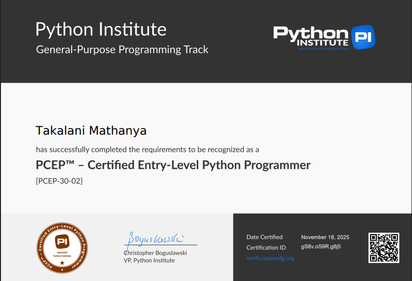

# JUNIOR BUSINESS ANALYST  

## 🧰 Tools & Technologies  

  
    
    
    
    
    
    
    
    
    
    

---

### 🔹 Technical Skills  

- Business Analysis: **Requirements Gathering | BRDs | User Stories | BPMN | UML | Process Mapping | Gap Analysis | UAT.**
- Data & Technical: **SQL (MySQL) | Python | Java | Power BI | Excel (Pivot Tables, VLOOKUP) | Data Cleaning.**
- Development Tools: **HTML | CSS | React | Git & GitHub.**
- Delivery Approach: **Agile Participation | Stakeholder Collaboration | Documentation & Reporting.**

---

## 📂 Key Projects  

| Cafeteria Sales Analysis | ERP System Dashboard |
|---|---|
| Sales & Inventory Data Analysis | Power BI Reporting System |
| 🔎 Analysed sales trends and stock levels   📊 Recommended stock optimisation improvements | 📈 Built interactive KPI dashboards   🧹 Cleaned and modelled data for accurate reporting |

---

# Analysis Focus  

  
    
    
    
    
    

  

<table>
<tr>
<td valign="top">

**Core Business Analysis Activities:**  
- Requirements Elicitation  
- Stakeholder Engagement  
- Process Mapping (BPMN/UML)  
- Gap Analysis  
- Documentation (BRDs & FRS)  
- UAT Support  

</td>
<td valign="top">

**Value Delivered:**  
- Structured Requirements Documentation  
- Clear Process Visualisation  
- Data-Driven Insights  
- Improved Reporting Accuracy  
- Support for Agile Delivery  
- Quality Assurance Contribution  

</td>
</tr>
</table>

---

## 🧮 Business Approach  

The structured analysis approach focuses on evaluating organisations across critical operational domains.

### 📊 Assessment Domains  

| Domain | Focus Area |
|------|-----------|
| **Financial Insight** | Reporting accuracy, budgeting visibility, KPI tracking |
| **Process Governance** | Documentation, accountability, structured workflows |
| **Operational Efficiency** | SOPs, consistency, performance measurement |
| **Market Awareness** | Data-driven insights and performance tracking |
| **Digital Enablement** | System usage, reporting tools, automation |
| **Compliance Awareness** | Risk exposure and documentation alignment |

---

### 📈 Example Portfolio View  

| Project | Data Analysis | Documentation | Reporting | Overall Impact |
|-------|---------------|---------------|-----------|----------------|
| Cafeteria Sales | ✔️ | ✔️ | ✔️ | Operational Improvement |
| ERP Dashboard | ✔️ | ✔️ | ✔️ | Decision Support |

---

### 📂 Analysis documents Examples 
- Click to View:

    
    
   
    
  

  

## 🎓 CERTIFICATION 

  
    
     

